## Week 1 9.23
1. 试写一个插入函数 InsertPost_seq(palist, p, x)，在 palist 所指的顺序表中，下标为 p 的元素之后，插入一个值为 x 的元素，返回成功与否的标志

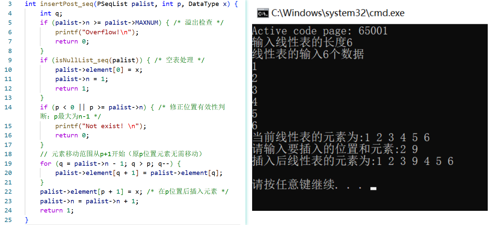

2. 写一个删除算法 deleteV_seq(palist, x)，在 palist 所指的顺序表中，删除值为 x 的元素，返回成功与否的标志


3. 设有一线性表 e = (e1,e2,……,en)，其逆线性表为(en,……,e2,e1)，设计一算法，将顺序表表示成顺序表的逆

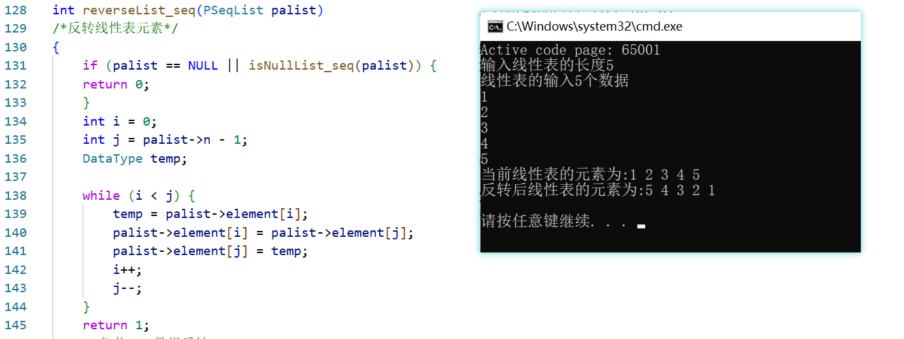

4. 已知长度为 n 的线性表为顺序存储，写一个算法，求出线性表中最小元素

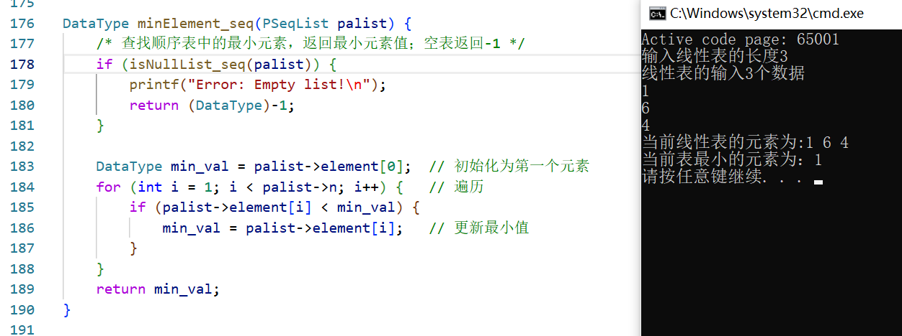

5. 已知线性表长度为 n，采用顺序存储，写出一算法，删除所有值为 x 的元素

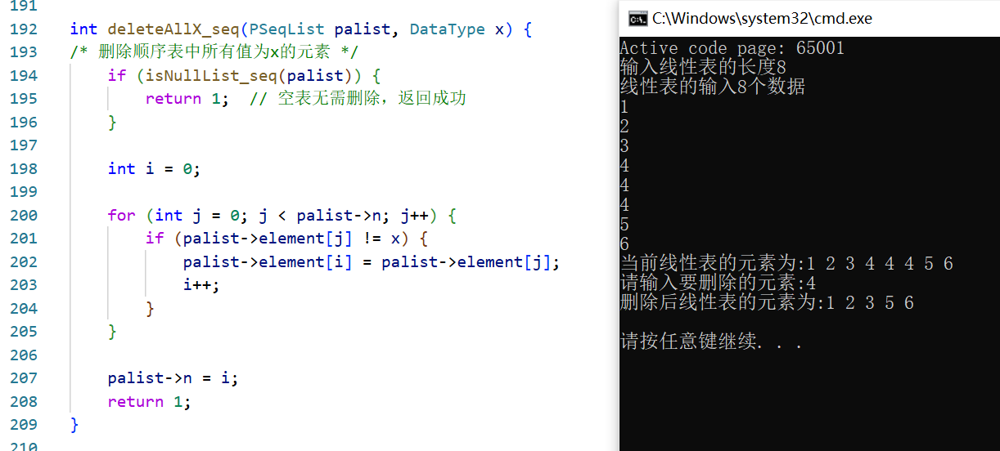


## Week 2 9.30
1. 编写打印单链表中所有数据的函数

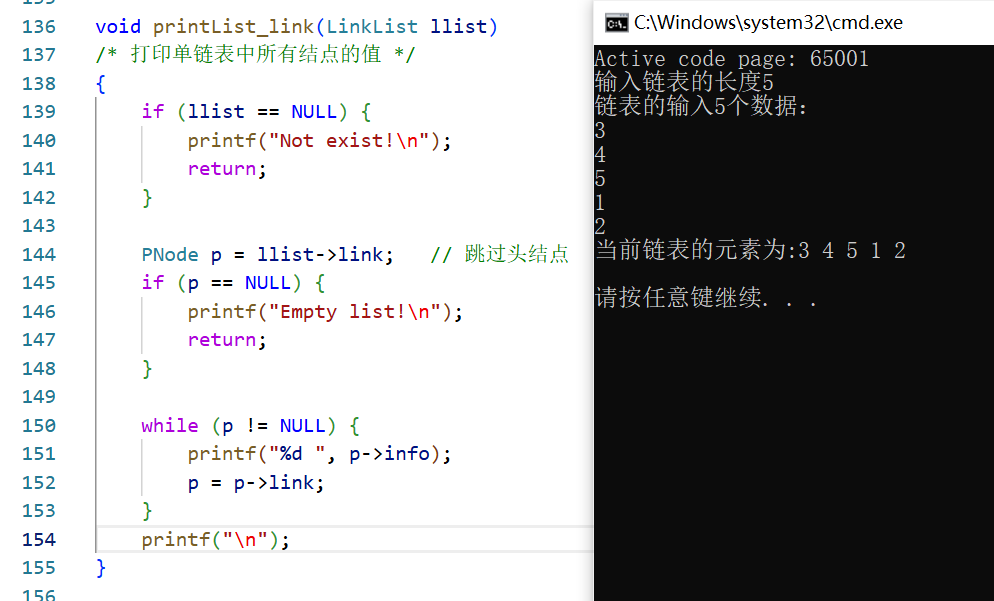

2. 求线性表中元素个数的函数

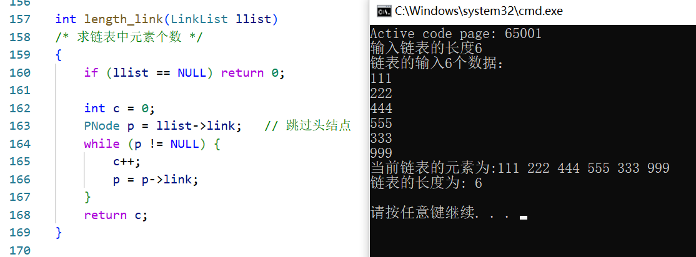

3. 写一函数，在带头节点的单链表 llist 中，p 指向的结点前边插入值为 x 的新结点，返回成功与否的标志

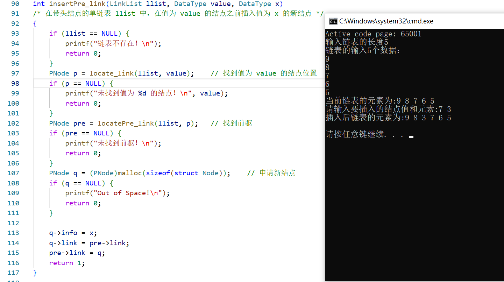

4. 写一函数，在带头结点的单链表 llist 中，删除 p 指向的节点，返回成功的标志

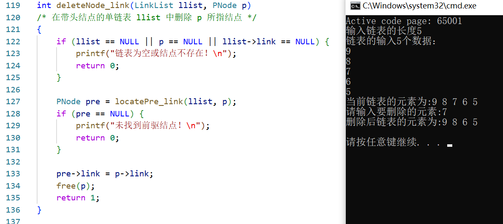

5. 已知 llist 为带头结点的单链表，删除下标为 i 的结点的算法

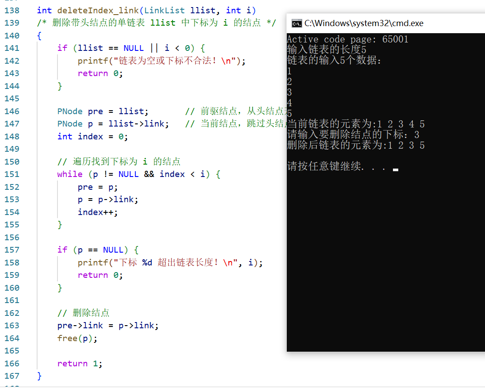

## Week3 10.14
1. 现有两个链式存储的线性表 palist 和 pblist，要求扩大线性表 palist：将在线性表 pblist 中而不在 palist 中的元素插入到 palist 中。
palist：2、3、4、6、7、1、11、13
pblist：5、6、7、8、9

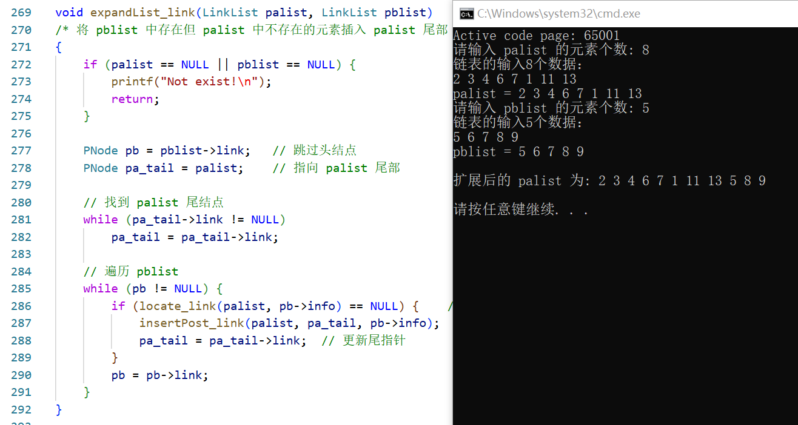


2. 已知两个有序递增的线性表 palist 和 pblist，创建线性表 pclist，将存在于 palist、pblist 中的元素添加到 pclist 中，使得 pclist 还是有序的（没有重复数据）
palist：2、3、4、6、7
pblist：5、6、7、8、9

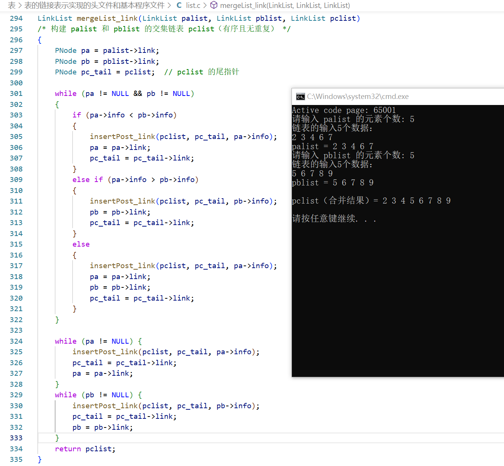

## 10.21
1. 设有一个长度为 s 的字符串采用顺序存储，现要求从此串的第 m 个字符开始删除长度为 t 的子串，m < s, t < (s - m).请写完成该功能的函数

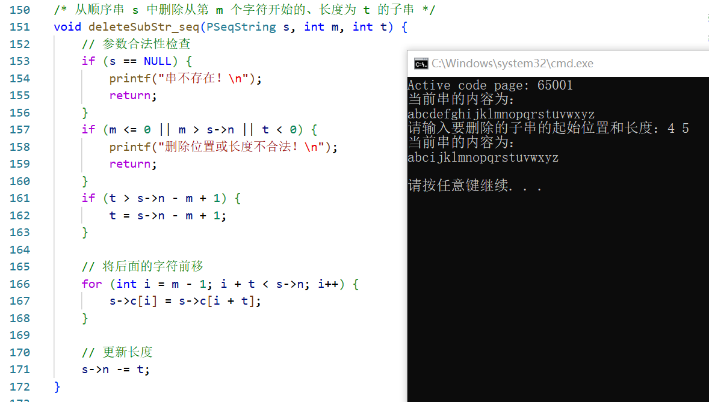

2. 编写一函数，判断一 DNA 片段是否包含另一段序列。

```txt
ATGGGAGGTT  CGTCTTCCAA  AGCTCGACAA
GGCATGGGGA  CGAATCTTTC  TGTTGCCAAT
CCTCTGGGAT  TCTTTCCCGA  TCACCAGTTG
GACCCTGGGT  TGGGAGCCAA  CTCAAACAAT
CCAGATTGGG  ACTTGAACCC  CAACAAGGAT
CACTGGCCAG  AGGCAAATCA  GGTAGGAGCG

TTCCTATGGGAGTGGCCCTCAG
```

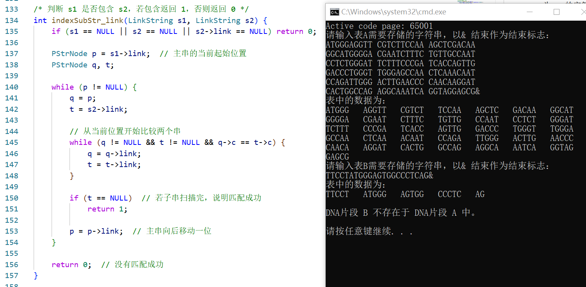

## 10.28
1. 字符串快速匹配算法（kmp）时，
目标串 `t = abcababcabc`
模式串 `p = abcabc`

    (1) 填充表格，完成 `next[i]` 计算

    | **下标** | 0 | 1 | 2 | 3 | 4 | 5 |
    | --- | --- | --- | --- | --- | --- | --- |
    | **p** | NULL | a | ab | abc | abca | abcab |
    | **k = next** | -1 | 0 | 0 | 0 | 1 | 2 |

    (2) 给出每一趟匹配，`j`、`i`（目标串和模式串的比较下标）的初始值和结束值

    1.
    || j | 值 | i | 值 |
    | --- | --- | --- | --- | --- |
    | 初始值 | 0 | a | 0 | a |
    | 结束值 | 5 | a | 5 | c |
     ```
    0123456789⒑
    abcababcabc
    abcabc
    012345
    ```

    2. 
    |后移3位| j | 值 | i | 值 |
    |-------|---|---|---|---|
    | 初始值 | 5 | a | 2 | c |
    | 结束值 | 5 | a | 2 | c |
    ```
    0123456789⒑
    abcababcabc
       abcabc
       012345
    ```

    3. 
    |后移2位| j | 值 | i | 值 |
    |-------|---|---|---|---|
    | 初始值 | 5 | a | 0 | a |
    | 结束值 | 11 | NULL | 6 | NULL |
    ```
    0123456789⒑
    abcababcabc
         abcabc
         012345
    ```

    (3) 结束时 `i` 的值是多少，有何意义？
    
    结束时 `i = 6`，说明已匹配过模式串最后一位，匹配成功

    返回模式串在目标串中位置


## 11.4
1. 编写一个算法，对于输入的十进制非负整数，将它的二进制表示打印出来

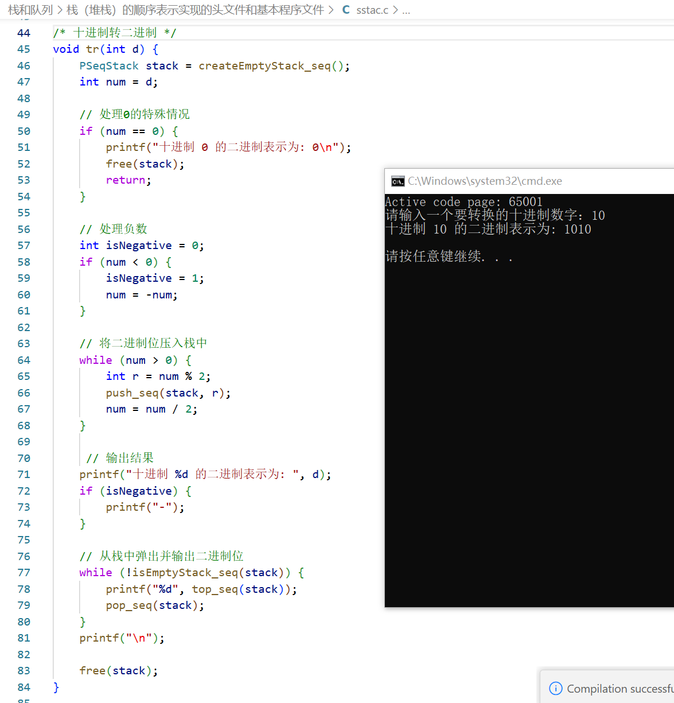

2. 写一个算法：PSeqStack  createEmptyStack_seq(int m)

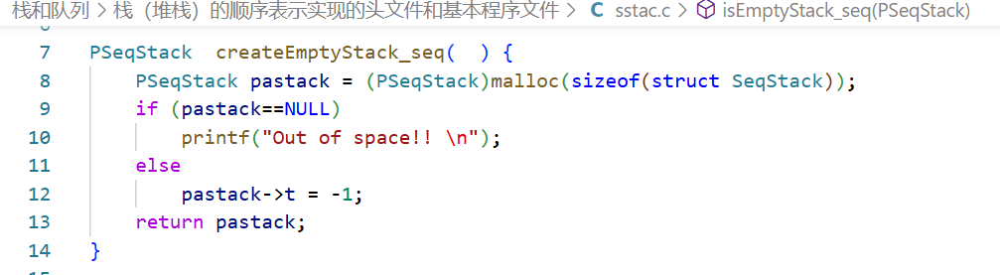


## 11.6
1. 斐波那契(Fibonocci)序列0,1,1,2,3,5,8……其中每个元素为前两之和，可递归定义为
fib(n)={n,当n=0,1时;fib(n-1)+fib(n-2),当n>2时}
给出计算 fib(n)的递归函数，并利用栈将该递归算法改成非递归函数。

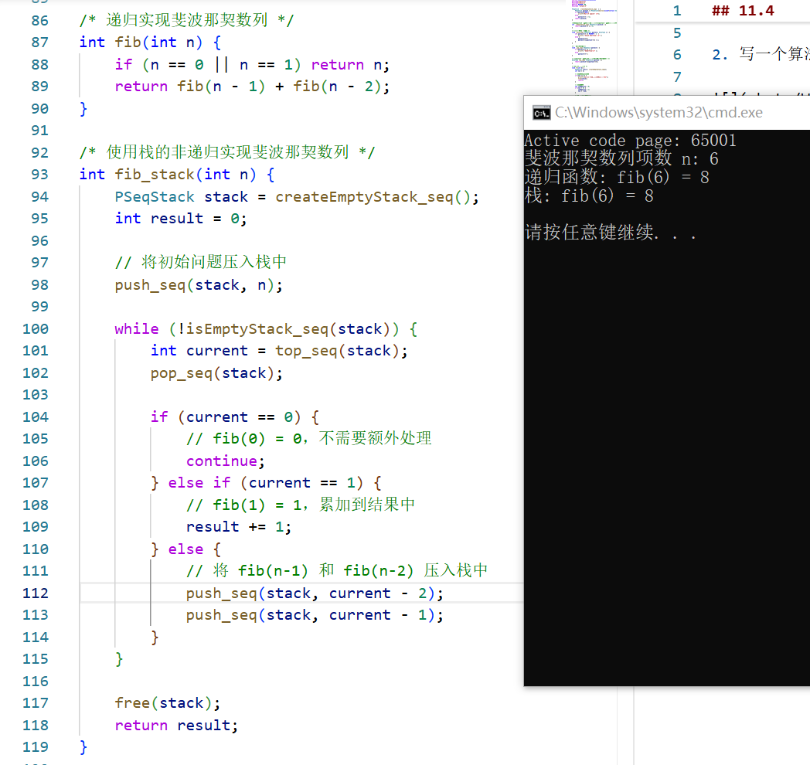

2. 写出 n 阶汉诺塔问题的递归函数，并利用栈，将该递归函数改写成非递归函数。

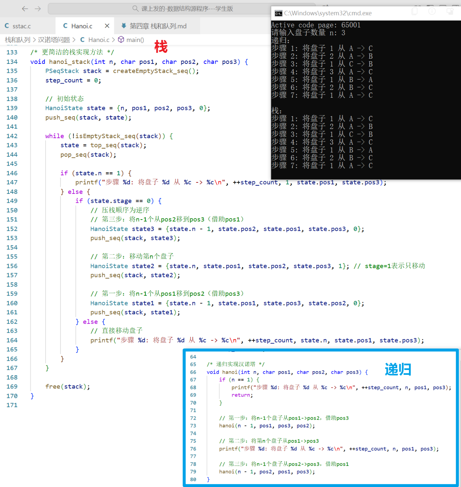


[汉诺塔-CSDN](https://blog.csdn.net/m0_63703622/article/details/140999009)

[汉诺塔-知乎](https://zhuanlan.zhihu.com/p/459055987)


3. 给出中缀表达式
`(2+3*5)*3+5`
的后缀表达式并计算后缀表达式的值。(要求有过程)

```C
原始中缀表达式: (2+3*5)*3+5

中缀转后缀过程:
当前字符        栈内容          输出
(               (
2               (               2
+               + (             2
3               + (             2 3
*               * + (           2 3
5               * + (           2 3 5
)              NULL             2 3 5 * +
*               *               2 3 5 * +
3               *               2 3 5 * + 3
+               +               2 3 5 * + 3 *
5               +               2 3 5 * + 3 * 5
Fin            NULL             2 3 5 * + 3 * 5 +

后缀表达式: 2 3 5 * + 3 * 5 +

计算后缀表达式过程:
当前字符        栈内容          计算说明
2               2               压栈
3               2 3             压栈
5               2 3 5           压栈
*               2 15            3 * 5 = 15
+               17              2 + 15 = 17
3               17 3            压栈
*               51              17 * 3 = 51
5               51 5            压栈
+               56              51 + 5 = 56

最终结果: 56
```

## 11.11
1. 写出创建空队列的函数(顺序存储)、打印队列数据的函数。

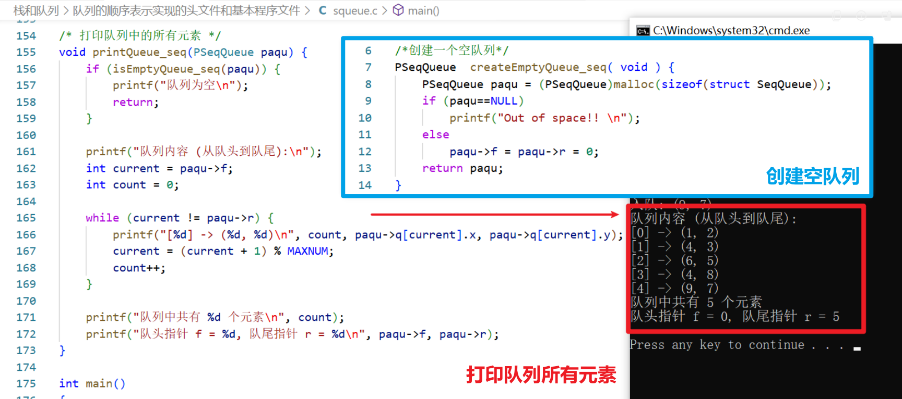

2. 写一算法，（不妨取名为 stackToQueue ）从一个栈创建一队列，使栈顶为队列的头，栈尾为队列的尾，算法最后要求使栈成为空栈。

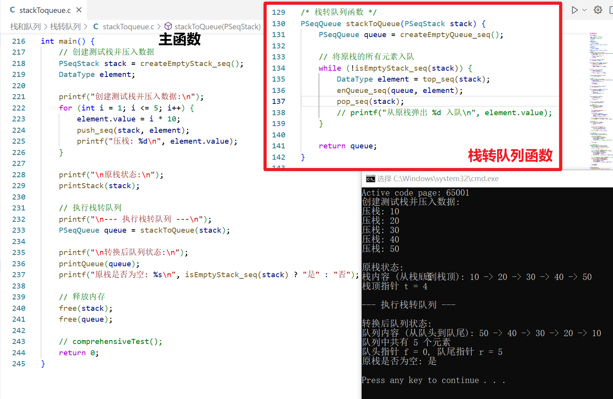

## 11.20
1. 二叉树顺序存储中:
    1. 写出创建空二又树的函数
    2. 完成主函数，实现建立如下二叉树,并输出其先根周游的结果。
```txt
        A(0)
       /    \
     B(1)   C(2)
    /  \    /  \
  D(3) E(4)F(5) G(6)
 /  \  /
H(7)I(8)J(9)
```

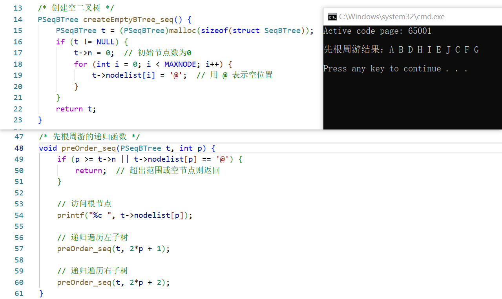

2. 在二又树的链接存储中，完成以下任务:
    1. 以建立如下二叉树为例，写出从终端输入数据的步骤
    2. 写出中序周游二叉树的递归函数
    3. 输出该二又树的中序周游序列
  A B D @ @ @ C E @ G @ @ F H @ @ I @ @
```txt
      A
     / \
    B   C
   /   / \
  D   E   F
       \ / \
        G H I
```

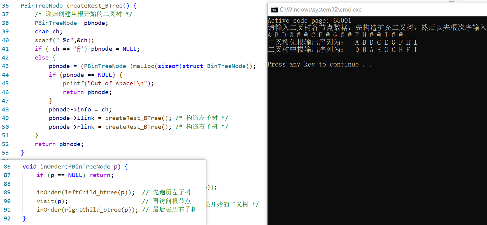

## 11.25
1. 链接存储二叉树时，写出以下三个递归函数:
    1. 计算二叉树的结点个数
    2. 计算二叉树叶结点的数量
    3. 计算二叉树的高度(深度)

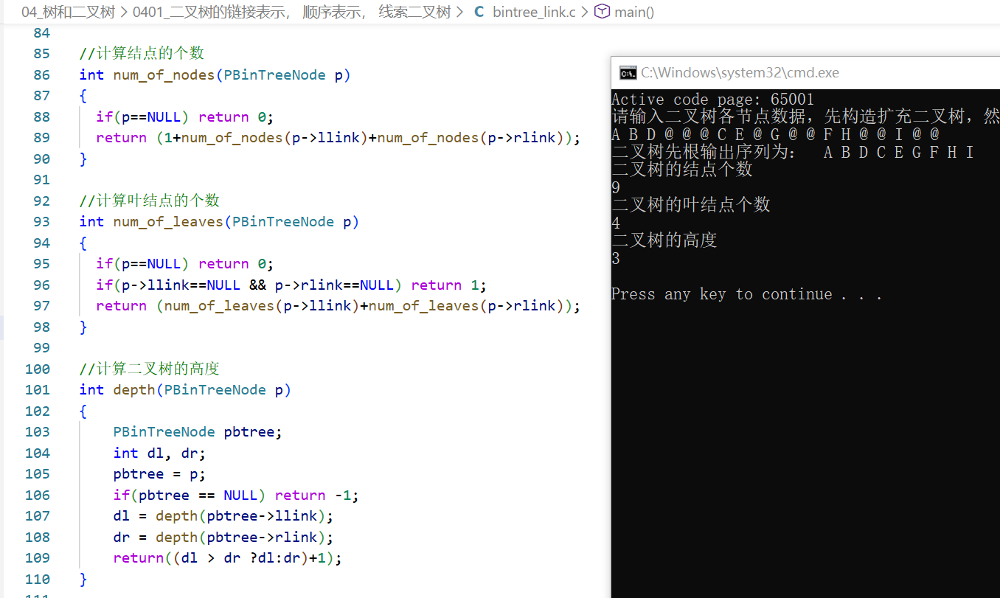

2. 仔细阅读对称序线索化程序并完成下列任务:
将下列二叉树线索化，并按对称序周游方式输出。

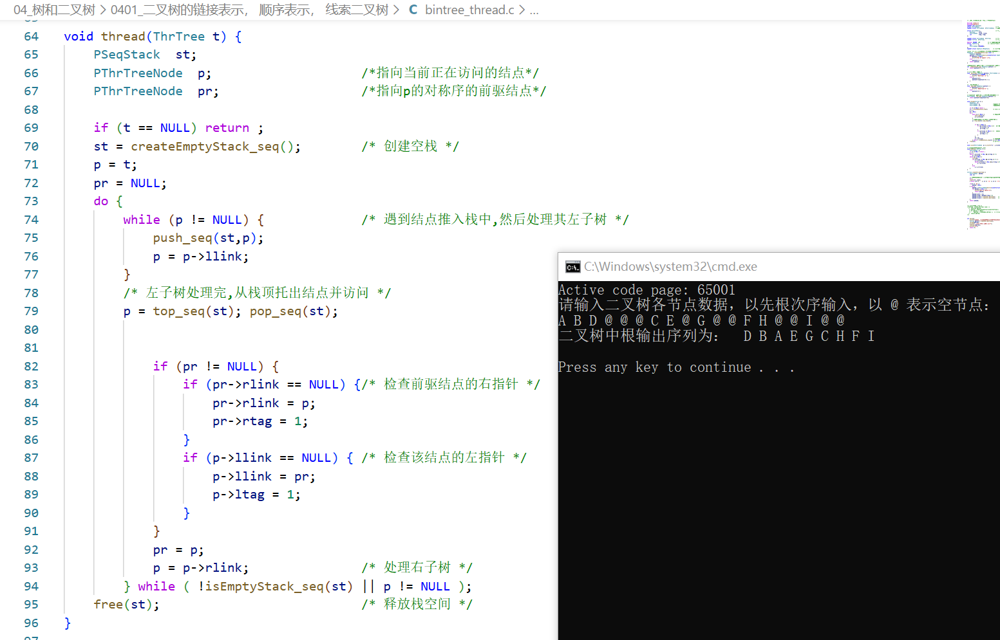

## 11.27
1. 权重 W = {2, 3, 5, 7, 11, 13, 15}
   1. 构造哈夫曼树;
   2. 画出哈夫曼树的存储结构
   3. 运行哈夫曼树程序，写出各权重对应的叶结点的编码。

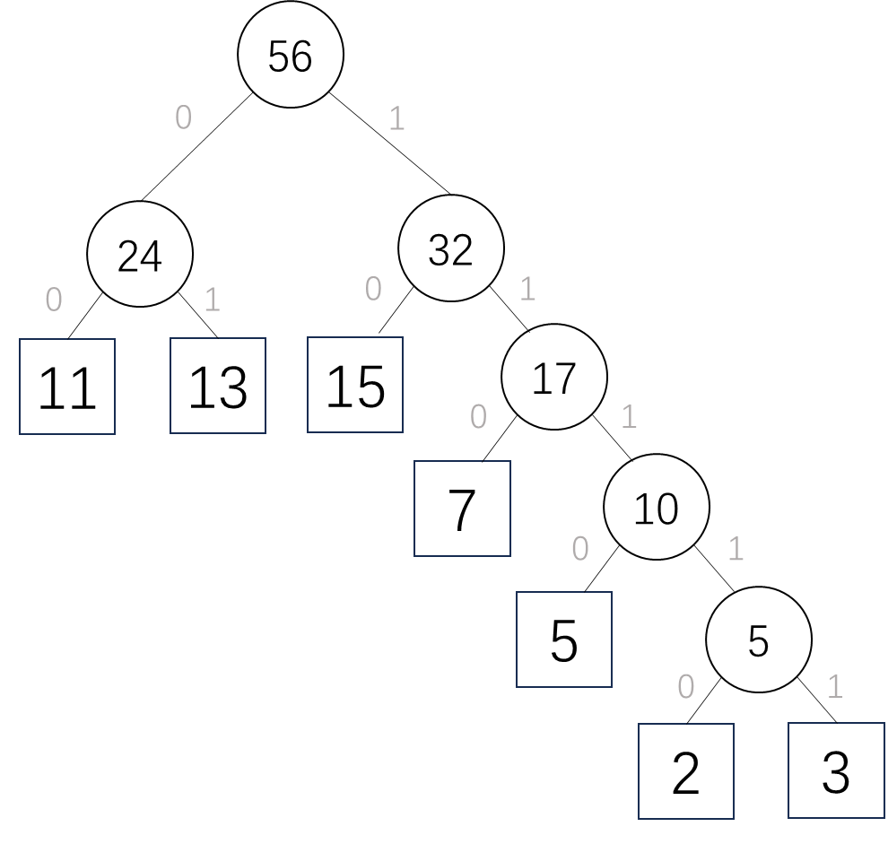

| 下标 | ww  | parent | lchild | rchild | 对应叶节点的编码 |
|------|-----|--------|--------|--------|------------------|
| 0    | 2   | 7      | -1     | -1     | 11110            |
| 1    | 3   | 7      | -1     | -1     | 11111            |
| 2    | 5   | 8      | -1     | -1     | 1110             |
| 3    | 7   | 9      | -1     | -1     | 110              |
| 4    | 11  | 10     | -1     | -1     | 00               |
| 5    | 13  | 10     | -1     | -1     | 01               |
| 6    | 15  | 11     | -1     | -1     | 10               |
| 7    | 5   | 8      | 0      | 1      |                  |
| 8    | 10  | 9      | 2      | 7      |                  |
| 9    | 17  | 11     | 3      | 8      |                  |
| 10   | 24  | 12     | 4      | 5      |                  |
| 11   | 32  | 12     | 6      | 9      |                  |
| 12   | 56  | -1     | 10     | 11     |                  |

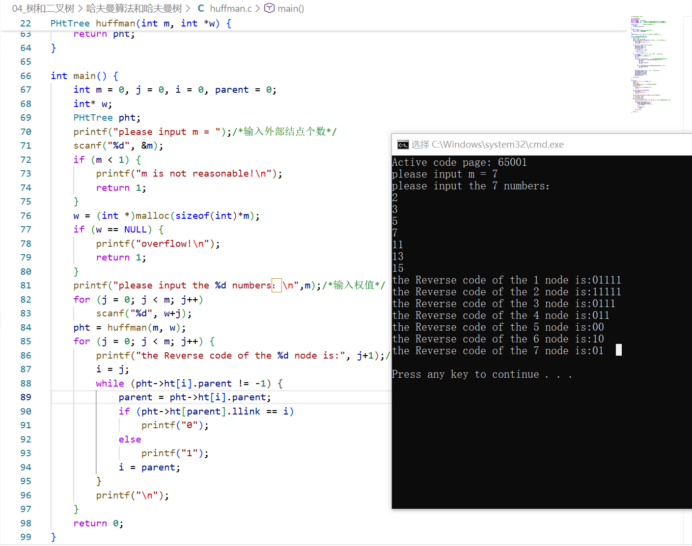

## 12.2
1. 用父指针表示法，存储下列树，并按
    1. 先根周游的方式输出该树的所有元素。
    2. 按后根周游的方式输出所有的元素
    3. 广度优先方式输出该树的所有元素。
```txt
          a(0)
        /      \
      b(1)     c(2) 
      /  \     /  \
   d(3)  e(4) f(5) g(6)
        / | \
    h(7) i(8) j(9)
```
```txt
          a(0)
        /      \
      b(1)     c(7) 
      /  \     /  \
   d(2)  e(3) f(8) g(9)
        / | \
    h(4) i(5) j(6)
```

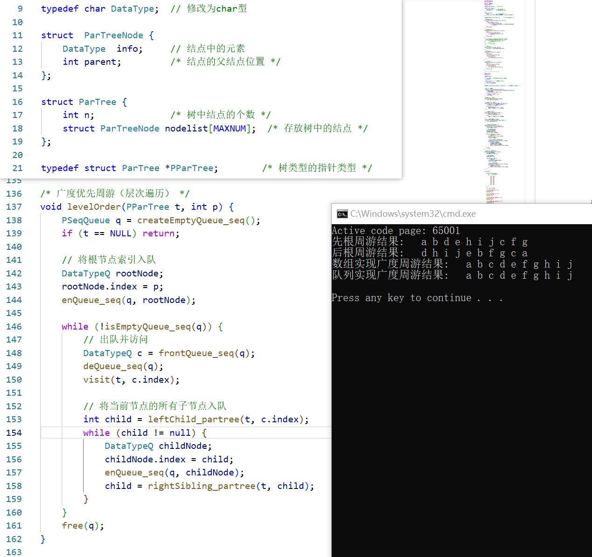

## 12.5
字典:
D={<'a',97>,<'b',98>,<'c',99>,<'d',100>,<'e',101>,<'f',102>,<'g',103>,<'h',104>,<'i',105>,<'j',106>}
1. 通过赋初值的方法建立该字典;
2. 编写主函数，对该字典做查询运算。


## 12.9
1. 程序题
编写函数(包括主函数)完成
     1. 建立下列关键码集合
     K={18,73,10,5,68,22,32,46,58,25}的字典，属性值为关键码的平方，采用线性探索法解决同义词的碰撞问题，h(key)=key%13;
     2. 完成按关键字查询的功能。


2. 应用题
上题中，基本空间的容量 m=13
完成:
     1. 给出散列表;
     2. 每个元素被查找的概率相等，求平均检索长度(ASL)

| 索引 | Key  | 属性值 | 原散列地址 | 探测次数 |
|------|------|--------|------------|----------|
| [0]  | 25   | 625    | 12         | 2        |
| [1]  | -    | -      | -          | -        |
| [2]  | -    | -      | -          | -        |
| [3]  | 68   | 4624   | 3          | 1        |
| [4]  | -    | -      | -          | -        |
| [5]  | 18   | 324    | 5          | 1        |
| [6]  | 5    | 25     | 5          | 2        |
| [7]  | 32   | 1024   | 6          | 2        |
| [8]  | 73   | 5329   | 8          | 1        |
| [9]  | 22   | 484    | 9          | 1        |
| [10] | 10   | 100    | 10         | 1        |
| [11] | 46   | 2116   | 7          | 5        |
| [12] | 58   | 3364   | 6          | 7        |

总比较次数 = 1+1+1+2+1+1+2+5+7+2 = 23 次
ASL = 总比较次数 / 元素个数 = 23 / 11 = 2.0909

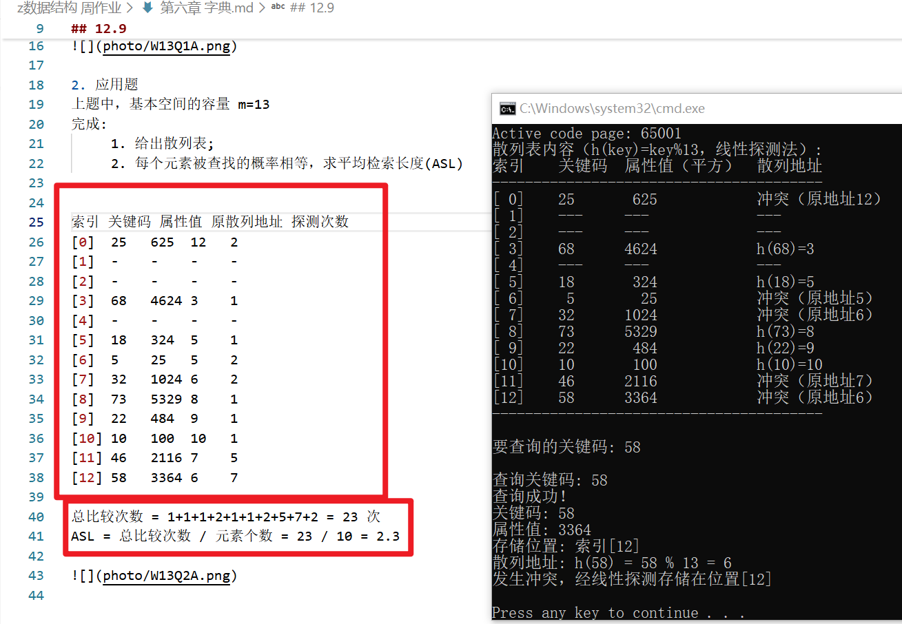

## 12.11
编写函数:
1. 建立下列图的邻接矩阵存储;
2. 输出深度周游的结果。
```txt
a(0) — d(3)
  |  ×
b(1) — c(2)
```

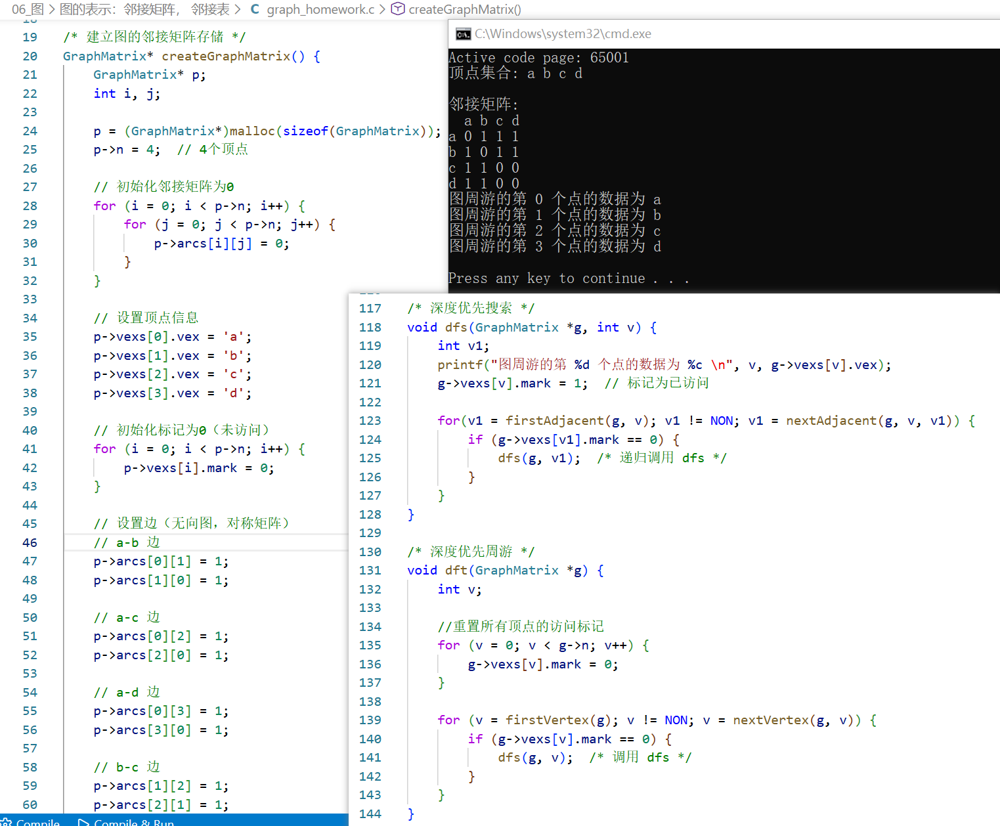

## 12.16
1. 程序题
求下列图的最小生成树(prim算法和Kruskal算法)
解释输出的结果

```txt
V0——3——V1
| \  6/   \11
5  ×       V4
| /  \8   /10
V2——2——V3
```

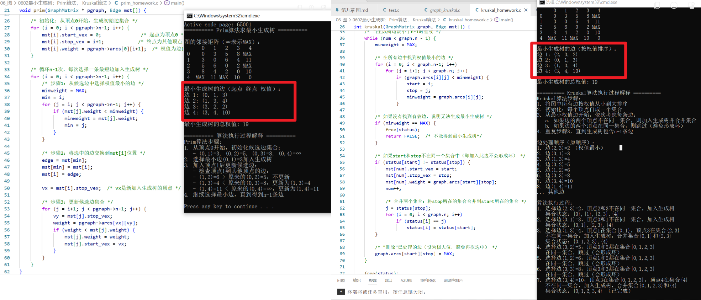

2. 应用题
给出上图的邻接矩阵arcs
用prim算法，给出最小生成树

矩阵
```txt
    0   1   2   3   4
0   0   3   5   8   ∞
1   3   0   6   4   11
2   5   6   0   2   ∞
3   8   4   2   0   10
4   ∞   11  ∞   10  0
```

```txt
顶点0 ──(权值3)── 顶点1
                   │
                   │(权值4)
                   │
顶点2 ──(权值2)── 顶点3 ──(权值10)── 顶点4
```

```txt
    V0
    │3
    V1
    │4
    V3
  ╱2  ╲10
 V2    V4
```


## 12.18
1. 程序题
对下列图，运行程序，验证Dijkstra算法和Floyd算法，解释输出结果。

```txt
V0——3——V1
| \  6/   \11
5  ×       V4
| /  \8   /10
V2——2——V3
```

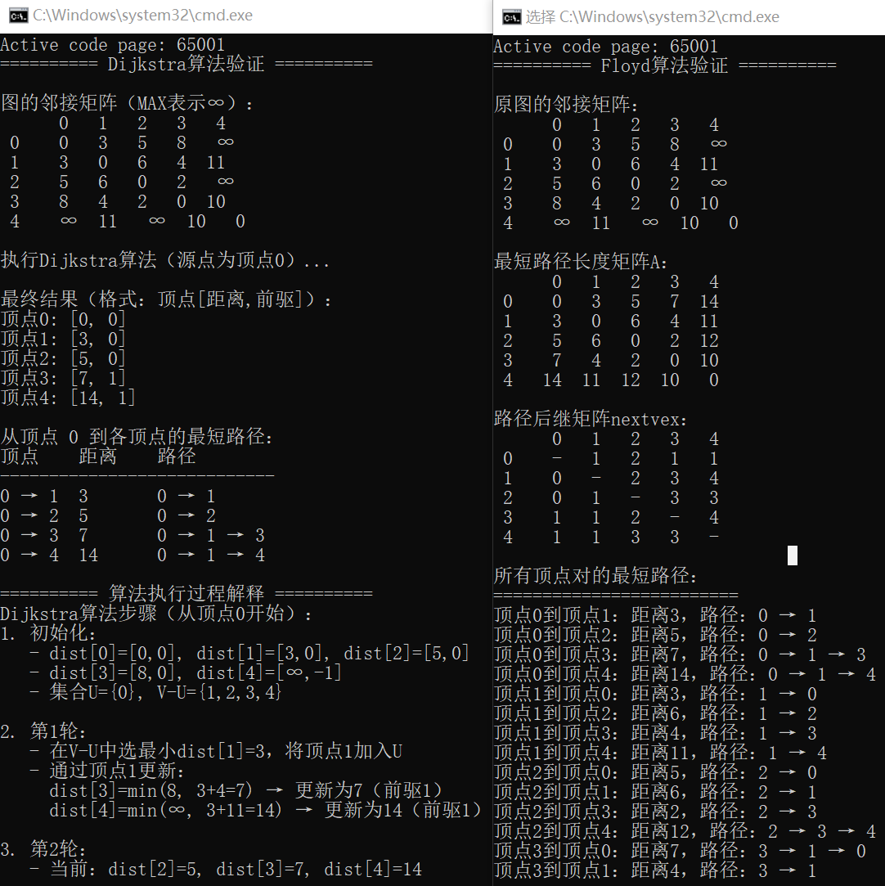

2. 画图题
画出上题的从V0出发，到各个顶点的最短距离的图形表示。

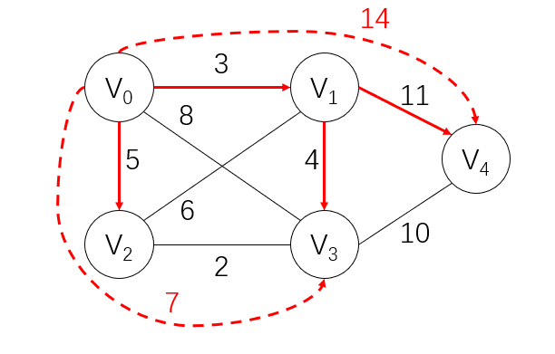

## 12.23
1. 程序题
编程输出下列有向图的：
   1. 拓扑序列
   2. 关键路径
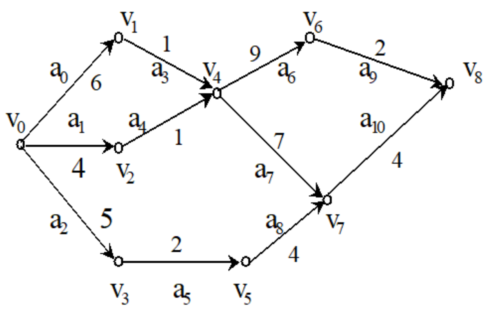

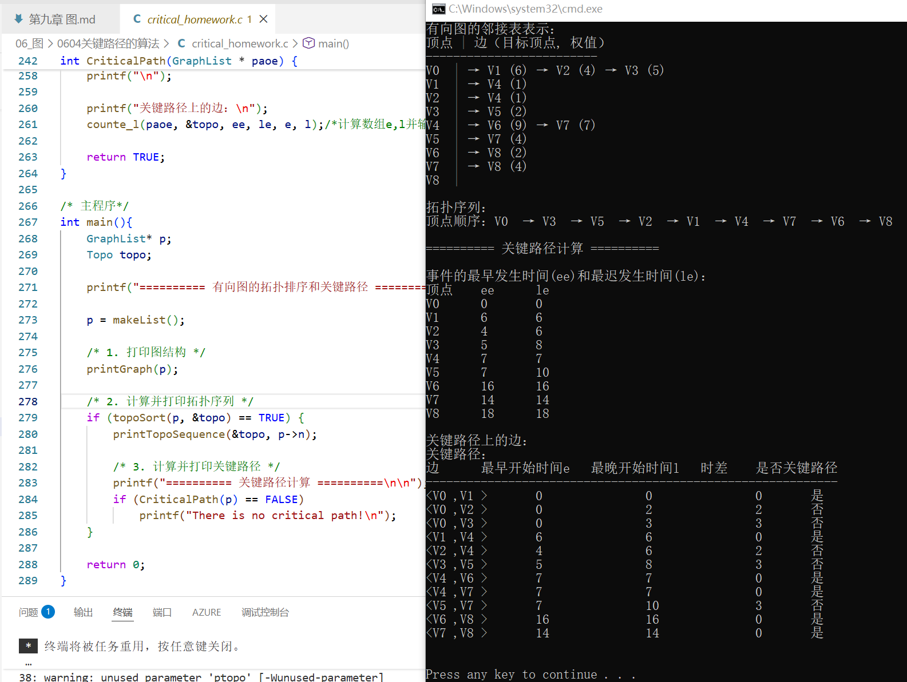

2. 应用题
对上边的AOE
   1. 填写下列两个表格，计算出顶点发生的最早时间、最晚时间，活动开始的最早时间、最晚时间
   2. 关键活动有哪些?
   3. 给出关键路径

| 顶点 | V0  | V1  | V2  | V3  | V4  | V5  | V6  | V7  | V8  |
|------|-----|-----|-----|-----|-----|-----|-----|-----|-----|
| ee[n]| 0   | 6   | 4   | 5   | 7   | 7   | 16  | 14  | 18  |
| le[n]| 0   | 6   | 6   | 8   | 7   | 10  | 16  | 14  | 18  |

| 边   | a1  | a2  | a3  | a4  | a5  | a6  | a7  | a8  | a9  | a10 | a11 |
|------|-----|-----|-----|-----|-----|-----|-----|-----|-----|-----|-----|
| e[k] | 0   | 0   | 0   | 6   | 4   | 5   | 7   | 7   | 7   | 16  | 14  |
| l[k] | 0   | 2   | 3   | 6   | 6   | 8   | 7   | 7   | 10  | 16  | 14  |

关键活动：a1 a4 a7 a8 a10 a11

关键路径：
```txt
V0 → V1 → V4 → V6 → V8
时间：0 + 6 + 1 + 9 + 2 = 18
路径：a1 → a4 → a7 → a10

V0 → V1 → V4 → V7 → V8
时间：0 + 6 + 1 + 7 + 4 = 18
路径：a1 → a4 → a8 → a11
```

